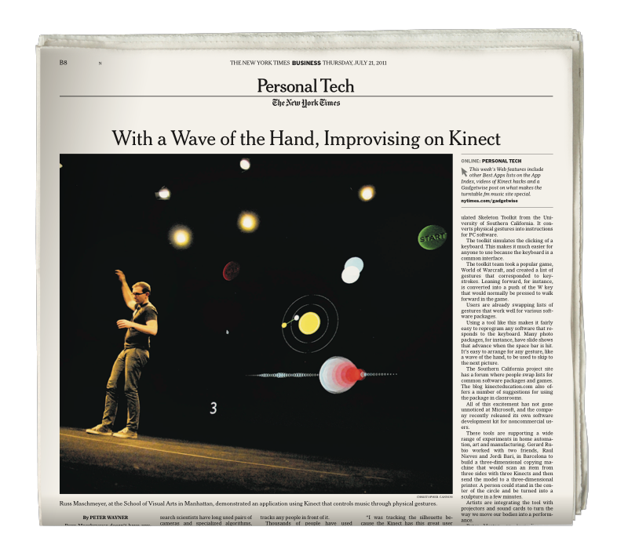
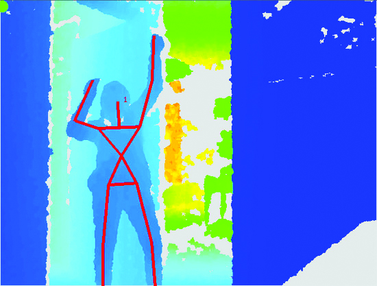

I hacked a Kinect to help people express themselves through music without having to learn an instrument and landed on the cover of the Times.

On July 21st, 2011 my graduate thesis project, <small>MOTIV</small>, appeared in a full page article on the front page of The New York Times Business section titled, [_With a Wave of the Hand, Improvising on Kinect._](https://www.nytimes.com/2011/07/21/technology/personaltech/kinect-hacking-finds-a-wider-crowd.html)

<small>MOTIV</small> used computer vision to connect a musician's movements to expressive musical parameters like note velocity and tempo during performance, unlocking a surprisingly intuitive control over the emotional qualities of a song without needing to learn an instrument.

<h3>Key Features</h3>
1. Load multi-track <small>MIDI</small> sequences from anywhere.
2. Select parameters you want to control during playback.
3. Plug in your Kinect to track your movement in real time.
4. On-screen graphics reflect and guide your movements.

<video controls>
    <source src="../assets/videos/motiv_jessica.mov" type="video/mp4">
</video>
<small class="media_description"><small>MOTIV</small> expression test, 2013</small>

As I entered my second year in grad school I was studying the neurological connections between music and emotion. Why does music make us feel anything at all? Turns out, our emotions are hard-wired to our body. Expression in music is directly connected to our intuitive understanding of the human body behind the sound.

Musicians love digital tools because they inspire new ways of creating, but they struggle with them too, having to tweak, abuse, and outright hack them into producing more emotionally resonant outputs. <small>MOTIV</small> aimed to recouple digital music-making tools to movement to unlock musical expression for all.

I was lucky to be able to build upon a rich body of open source development after the release of Microsoft's Kinect. <small>MOTIV</small> owes a large debt to the [OpenFrameworks](https://openframeworks.cc) community.

<small class="media_description">Early <small>MOTIV</small> skeleton tracking using the <a href="https://github.com/structureio/OpenNI2/tree/kinect2" target="_blank">openNI library.</a></small>

While computer vision and digital music making tools have come a long way since then, the underlying success of MOTIV was creating an experience that anyone could use to express themselves through music. Just as noble a pursuit today as it was then, no matter the underlying tech.

For a deeper dive check out my thesis book, <a href="../assets/files/MOTIV_Once-More-with-Feeling.pdf" target="_blank">Once More, with Feeling.</a>

***

<h3>Thesis Collaborators:</h3>
- Advisors: Nicholas Felton, Robin Bargar
- Professors: Paul Pangaro, Jennifer Bove
- MFA Chair: Liz Danzico

***

<h3>Press</h3>
- The New York Times: [With a Wave of the Hand, Improvising on Kinect](https://www.nytimes.com/2011/07/21/technology/personaltech/kinect-hacking-finds-a-wider-crowd.html)