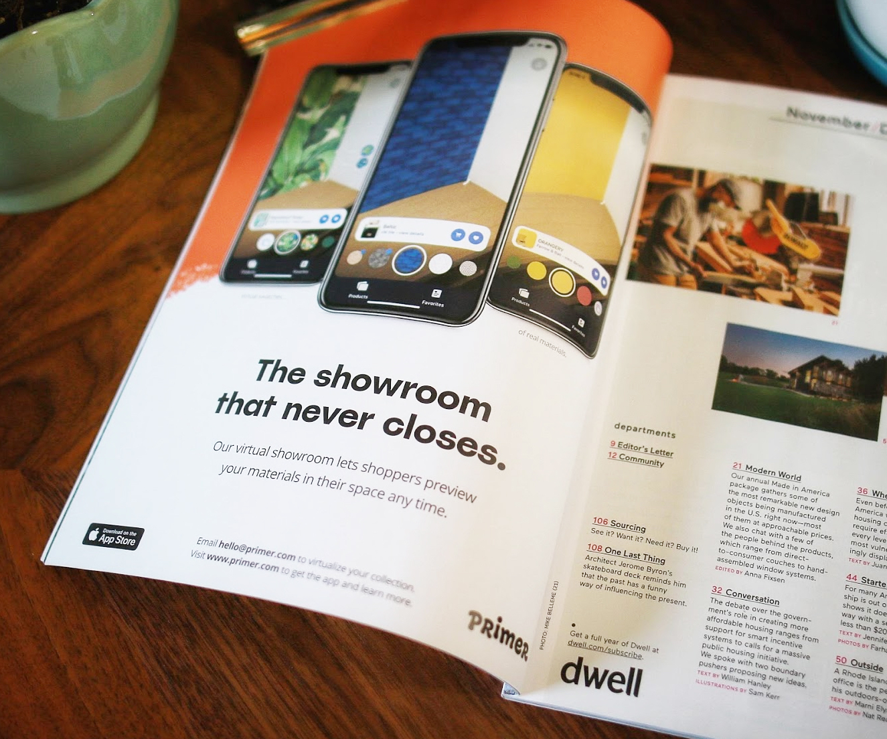

Acquired by Shopify in 2021, Primer's app let you to try and buy paint, tile, and wallpaper from curated brands in your space with augmented reality.

<video controls>
    <source src="../assets/videos/primer_launch.mp4" type="video/mp4">
</video>
<small class="media_description">Primer launch video, 2019</small>

Every renovator has wished for something like Primer: a magic tool that lets you preview changes to your space instantly with real products you can buy. 

When <small>COVID</small>-19 shuttered interior design showrooms and transformed the $750B home industry overnight, Primer made it possible for brands like Farrow & Ball and clé tile to beam their finishes directly into a shopper's home with augmented reality <small>(AR)</small>.

    

        <video muted autoplay loop>
            <source src="../assets/videos/primer_blending.mp4" type="video/mp4">
        </video>
    

    

        <h3>Key Features</h3>
        <ol style="font-size: smaller; margin-bottom: 0; margin-right: 1em;">
            <li>Preview paint, tile, & wallpaper in your space with <small>AR</small></li>
            <li>Browse thousands of premium finishes from top designeers</li>
            <li>Save your favorites and share video previews with friends</li>
            <li>Purchase fast with automatic order size estimation</li>
        </ol>
    

    

    

We built a product virtualization pipeline that turned 2D image assets into 3D textures at a low cost, with incredible fidelity and speed. Our rendering engine beautifully simulated previously challenging material features like metallic foil, high-gloss, and detailed surface textures by modeling the light in your space to simulate reflections in real time.

<video muted controls style="margin-bottom: 1em;">
    <source src="../assets/videos/primer_product.m4v" type="video/mp4">
</video>

Primer was lucky to be backed by exceptional folks at Designer Fund, Expa, Foundation Capital, and Slow Ventures and to have been heavily evangelized by Apple with repeated features in the App Store and a "Developer Spotlight" editorial. 

Apple also highlighted Primer in the <small>WWDC</small> 2021 video: [Explore ARKit 5](https://developer.apple.com/videos/play/wwdc2021/10073/) and installed Primer on every display device across their North American stores to help demonstrate the latest advances in ARKit 5. 

As co-founder and CEO, I built the vision and team for Primer from the ground up, gradually recruiting an exceptional roster of talent, including my co-founder, Adam Debreczeni. We built a powerhouse roster of brands and one of the best AR app experiences on the market.

<video muted controls>
    <source src="../assets/videos/primer_materialGen.mp4" type="video/mp4">
</video>
<small class="media_description">Our virtualization pipeline rapidly modeled merchant SKUs.</small>

I'm so proud of the technology and partnerships we built together, but I'm most proud of the exceptional team and culture we built together. It was our fast, innovative culture and a shared vision for bringing together spacial computing and commerce that first caught the attention of our friends at Shopify.

When Shopify extended an opportunity to accelerate this future for the millions of merchants running on their platform, it was too good to pass up. The Primer team joined Shopify in June, 2021.

While my time managing design teams at Facebook taught me the nuts and bolts of daily execution amid hypergrowth, Primer taught me how to build exceptional cross-functional teams, then align and inspire them to build magical experiences.

Deep gratitude to my family, friends, and the team as well as our investors, partners, and everyone who ever gave us a download or cheered us on. 🫶

<small class="media_description">Primer advertisement. Dwell Magazine, November 2020.</small>

***

<h3>Press</h3>
- Business of Home: [Is Primer Wallaper's New Best Friend?](https://businessofhome.com/articles/is-primer-wallpaper-s-new-best-friend)
- Architectural Digest: [Obsessed With the Wallpaper in The Queen’s Gambit? Here’s How to Get the Look](https://www.architecturaldigest.com/gallery/the-queens-gambit-wallpaper-inspiration)
- Print Magazine: [Brand of the Day](https://www.printmag.com/branding-identity-design/brand-of-the-day-primer/)
- Apartment Therapy: [This Free App Will Help You Visualize Wallpaper and Tile on Your Walls](https://www.apartmenttherapy.com/primer-app-for-tile-and-wallpaper-36747708)
- House Beautiful: [This App Lets Virtually Test Drive Wallpaper and Tiling From Popular Design Brands in Your Home](https://www.housebeautiful.com/design-inspiration/a32271058/primer-app-virtually-envision-wallpaper-tiles-at-home/)
- LONNY: [How To Update Your Space Without Going Anywhere](https://www.lonny.com/How+To+Update+Your+Space+Without+Going+Anywhere)
- Techcrunch: [Shopify brings on team from augmented reality home design app Primer](https://techcrunch.com/2021/06/11/shopify-acquires-augmented-reality-home-design-app-primer/)